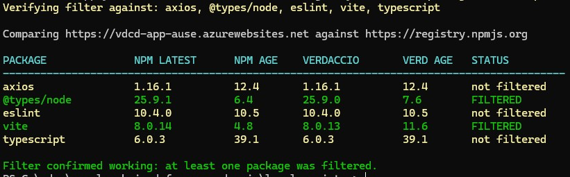

# local-registry

Runs Verdaccio locally as a time-gated npm proxy. Packages are filtered so that only versions at least `minAgeDays` old are visible as `latest`. Uses the same `verdaccio-image/` Dockerfile as the Azure deployment — config is baked into the image.

## Prerequisites

- Docker Desktop running
- PowerShell 7+

## Usage

### Run with default 7-day cooldown

```powershell
.\build-docker-verdaccio.ps1
```

### Run with a custom cooldown

```powershell
.\build-docker-verdaccio.ps1 -MinAgeDays 14
```

### Block a specific version

```powershell
.\build-docker-verdaccio.ps1 -PackageBlocks "next@15.3.2"
```

### Block a version and allow a patched replacement through the age gate

```powershell
.\build-docker-verdaccio.ps1 -PackageBlocks "next@15.3.2" -PackageOverrides "next@16.2.6"
```

Multiple entries are comma-separated: `"next@15.3.2,lodash@4.17.20"`.

### Verify the filter

```powershell
.\check-package-versions.ps1
.\check-package-versions.ps1 -Packages next,react,axios
```

### Example output



Green rows confirm the filter is active — Verdaccio is serving an older version because the npm latest is too new. Yellow rows mean the npm latest is already old enough to pass through unchanged.

## How it works

The image is built from `verdaccio-image/` — the same Dockerfile used for Azure. `minAgeDays` is baked in via a build argument; `PACKAGE_BLOCKS` and `PACKAGE_OVERRIDES` are passed as environment variables at container start time.

See [verdaccio-image/README.md](../verdaccio-image/README.md) for plugin details.

## File layout

```
build-docker-verdaccio.ps1   # build image, start container
check-package-versions.ps1   # compare verdaccio vs npm to verify filtering
build-and-check.ps1          # orchestrator: runs both scripts end-to-end
```
